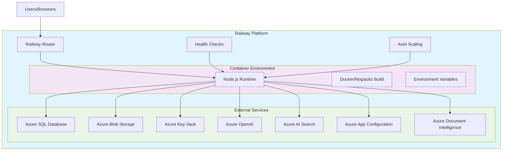
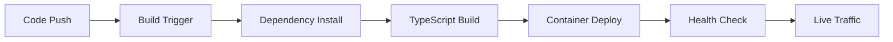

# AIVA Backend Deployment Architecture

## Railway Deployment Overview

## Deployment Components

### 1. Application Container
- **Runtime**: Node.js 18+ on Alpine Linux
- **Build Process**: TypeScript compilation to JavaScript
- **Entry Point**: `dist/index.js`
- **Port**: Configurable via `PORT` environment variable

### 2. Build Process
1. Install production dependencies with `npm ci`
2. Compile TypeScript with `npm run build`
3. Start application with `npm start` (node dist/index.js)

### 3. Environment Configuration
All Azure service connections and application settings are configured through environment variables in the Railway dashboard.

### 4. External Services
The application integrates with multiple Azure services:
- **Database**: Azure SQL Database for user data and chat history
- **Storage**: Azure Blob Storage for file uploads
- **Security**: Azure Key Vault for secret management
- **AI Services**: Azure OpenAI for chat responses
- **Search**: Azure AI Search for semantic search capabilities
- **Configuration**: Azure App Configuration for runtime settings
- **Document Processing**: Azure Document Intelligence for file analysis

## Health Monitoring

### Health Endpoint
- **Path**: `/health`
- **Method**: GET
- **Response**: JSON with service status information

### Health Checks
Railway performs periodic health checks to ensure the application is running correctly.

## Scaling

Railway automatically handles:
- Container scaling based on demand
- Resource allocation
- Load balancing
- Failover and recovery

## Deployment Pipeline

1. **Code Changes**: Push to connected repository or upload new code
2. **Build Trigger**: Railway automatically detects changes and starts build
3. **Dependency Install**: `npm ci` installs production dependencies
4. **TypeScript Build**: `npm run build` compiles TypeScript to JavaScript
5. **Container Deploy**: Application is deployed in containerized environment
6. **Health Check**: Railway verifies application health
7. **Live Traffic**: Traffic is routed to the new deployment